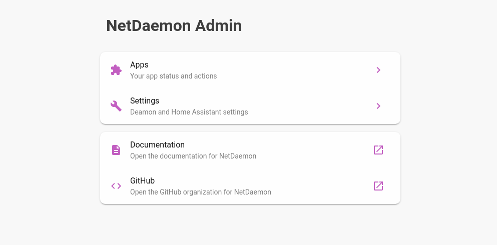
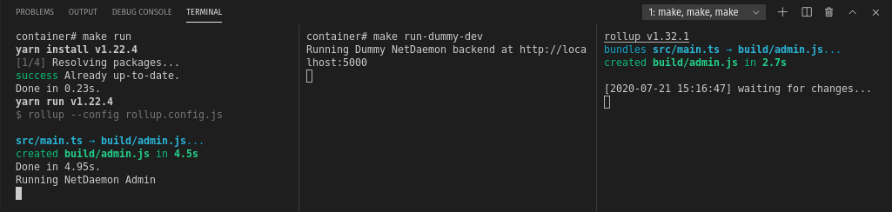

# Admin panel for NetDaemon

_This is bundled with the container installations of NetDaemon._

## Development

1. Start the devcontainer
1. run `make` to see what's there.

For full development setup you need to run 3 commands:

- `make start` - Uses rollup to rebuild when needed.
- `make run` - Run the admin site using node express.
- `make run-dummy-dev` - Runs a dummy server that gives the same response as the NetDaemon backend.

_the admin site will be available on port 1337_

